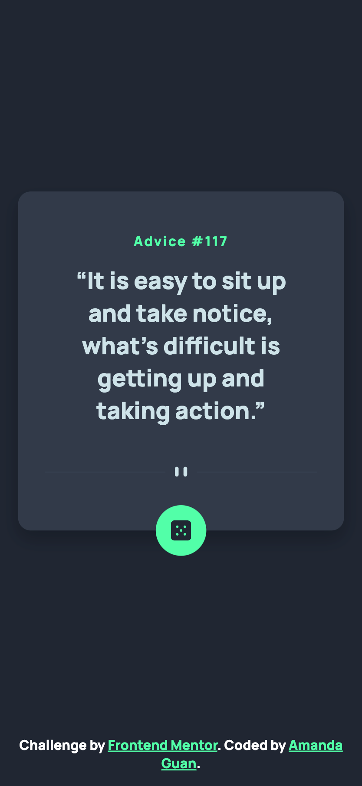
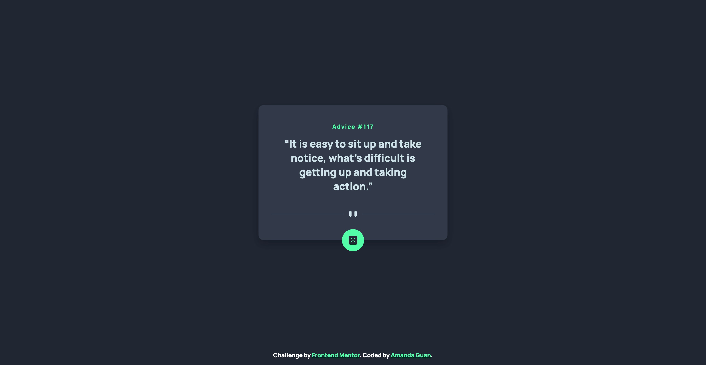

# Frontend Mentor - Advice generator app solution

This is a solution to the [Advice generator app challenge on Frontend Mentor](https://www.frontendmentor.io/challenges/advice-generator-app-QdUG-13db). 

## Table of contents

- [Overview](#overview)
  - [The challenge](#the-challenge)
  - [Screenshot](#screenshot)
  - [Links](#links)
- [My process](#my-process)
  - [Built with](#built-with)
  - [What I learned](#what-i-learned)
  - [Continued development](#continued-development)
  - [Useful resources](#useful-resources)
- [Author](#author)

## Overview

### The challenge

Users should be able to:

- View the optimal layout for the app depending on their device's screen size
- See hover states for all interactive elements on the page
- Generate a new piece of advice by clicking the dice icon

### Screenshot




### Links

- [Solution URL](https://github.com/amandaguan-ag/advice-generator-app-main)
- [Live Site URL](https://amandaguan-ag.github.io/advice-generator-app-main/)

## My process

### Built with

- Semantic HTML5 markup
- CSS custom properties
- Flexbox
- Mobile-first workflow

### What I learned

During this project, I learned the importance of accessibility and responsive design. Here are a few key learnings:

- **Aria attributes**: I added `aria-live` and `aria-label` to improve screen reader support.
- **CSS Flexbox**: I used Flexbox to center the main content and ensure it remains centered across different screen sizes and orientations.
- **Responsive images**: I utilized the `<picture>` element to serve different images based on the device's screen width.

Here is a code snippet that showcases some of these improvements:

```html
<blockquote class="advice-text" id="advice-text" aria-live="polite">
  “It is easy to sit up and take notice, what’s difficult is getting up and taking action.”
</blockquote>
```

```css
body {
    display: flex;
    flex-direction: column;
    justify-content: space-between;
    min-height: 100vh;
    margin-block: 1rem;
}
```

### Continued development

In future projects, I plan to continue focusing on accessibility and responsive design. I also want to delve deeper into using CSS Grid for layout management and improving my JavaScript skills for more dynamic and interactive web applications.

### Useful resources

- [MDN Web Docs](https://developer.mozilla.org/) - This is my go-to resource for all things web development. It has comprehensive documentation and examples.
- [CSS Tricks](https://css-tricks.com/) - This site offers great tips and tricks for CSS, which helped me understand Flexbox and responsive design better.

## Author

- LinkedIn - [Amanda Guan](https://www.linkedin.com/in/amandaguan1/)
- Github - [@amandaguan-ag](https://github.com/amandaguan-ag)